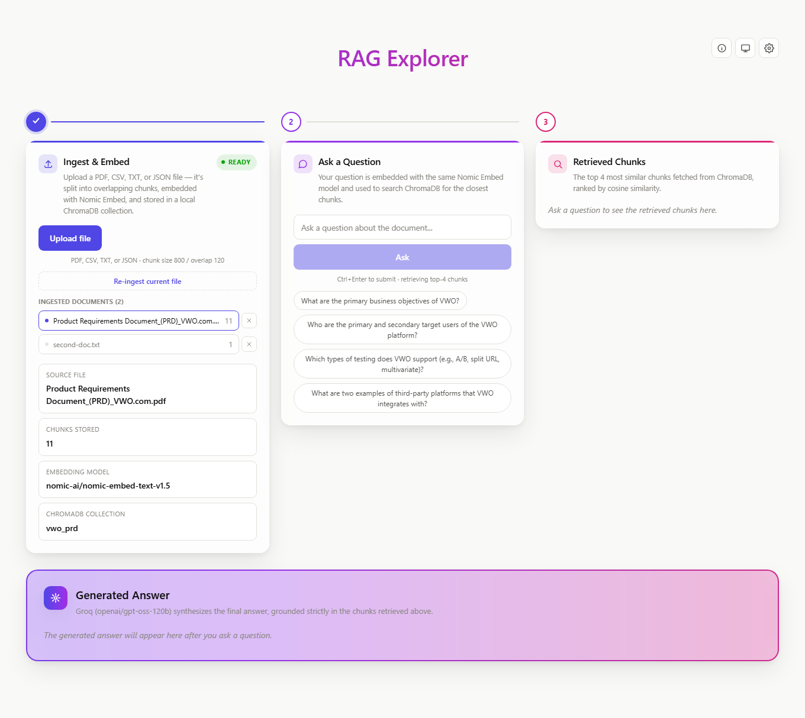
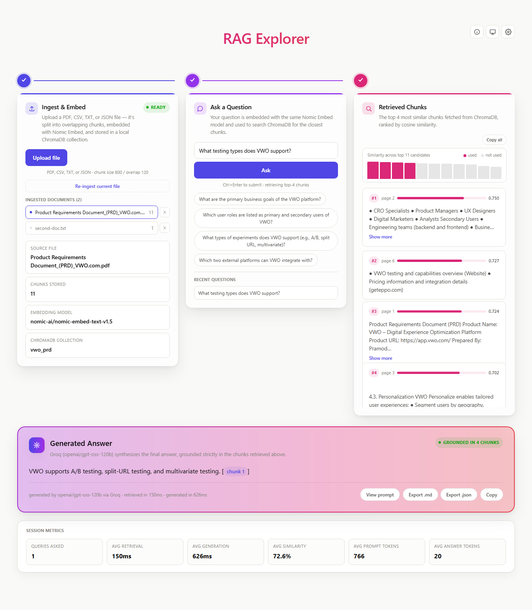
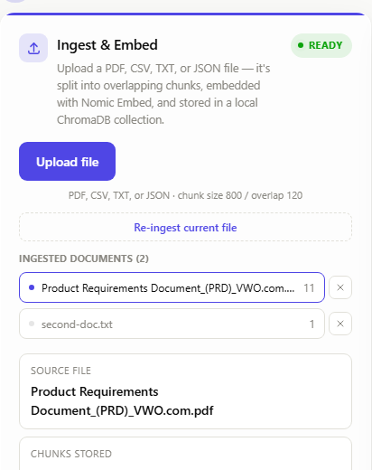
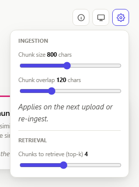
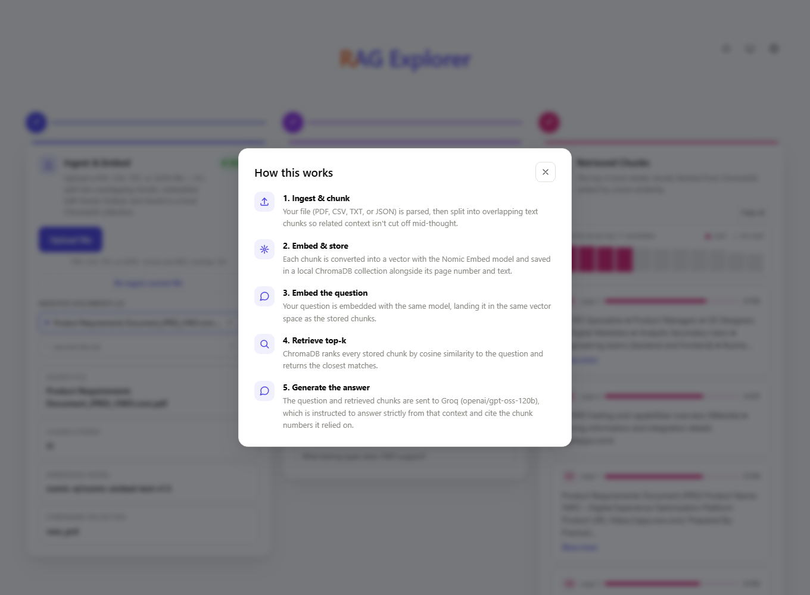
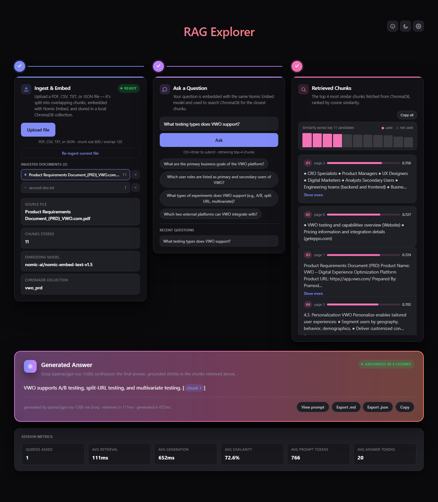
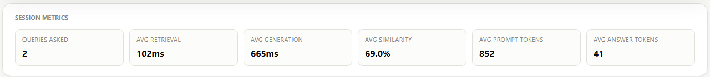
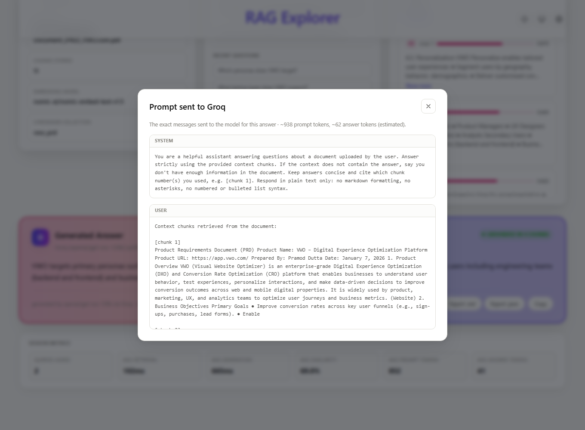

# RAG Explorer

A transparent, end-to-end RAG (Retrieval-Augmented Generation) pipeline with a
React UI that shows every stage: ingestion, chunking, embedding, vector
storage, retrieval, and answer generation — over any PDF, CSV, TXT, or JSON
file you upload.

- **Backend:** FastAPI (Python 3.12), `pypdf`, `sentence-transformers`
  (`nomic-ai/nomic-embed-text-v1.5`), ChromaDB (local persistent store), Groq
  (`openai/gpt-oss-120b`)
- **Frontend:** React + Vite, Framer Motion

## Screenshots

**Pipeline overview** — the three-stage flow (Ingest & Embed → Ask a Question
→ Retrieved Chunks), with a document already ingested:



**Full pipeline in action** — the generated answer cites the chunk numbers it
used (clickable, jumps to the matching card), a "Grounded in N chunks" badge
confirms the answer came from the document, a similarity drop-off chart shows
how the top-k chunks compare to the wider candidate pool, and the session
metrics strip tracks running totals underneath:



**Multi-document switcher** — multiple documents can be ingested and kept
side by side; click one to make it active, or remove it:



**Settings popover** — chunk size/overlap and retrieval top-k, applied on the
next ingest:



**"How this works" modal** — a walkthrough of the five pipeline stages:



**Dark mode:**



**Session metrics** — running totals for the session (queries asked, avg
retrieval/generation time, avg similarity, avg prompt/answer tokens):



**Prompt inspection** — "View prompt" shows the exact system + user messages
sent to Groq for that answer, with estimated prompt/answer token counts:



## Project layout

```
BASIC_RAG/
  data/data/              # uploaded/source files land here
  backend/
    app/
      main.py              # all API endpoints (see table below)
      schemas.py            # Pydantic request/response models
      rag/                  # file_loader, pdf_loader, chunker, embeddings,
                             # vector_store (document registry), retriever, llm
    chroma_store/           # local ChromaDB persistence + documents.json (gitignored)
    requirements.txt
    .env.example
  frontend/                 # React + Vite UI
```

## 1. Backend setup

Requires **Python 3.12** (ChromaDB's native dependency `chroma-hnswlib` has no
prebuilt Windows wheel for 3.13+ yet).

```bash
cd backend
py -3.12 -m venv venv
./venv/Scripts/pip install -r requirements.txt
copy .env.example .env   # then edit .env and set GROQ_API_KEY
```

Get a free Groq API key at https://console.groq.com/keys.

Run the API:

```bash
./venv/Scripts/uvicorn app.main:app --reload --port 8000
```

The first ingest downloads the Nomic Embed model (~500MB) from Hugging Face,
so it can take a minute the first time.

## 2. Frontend setup

```bash
cd frontend
npm install
npm run dev
```

Open http://localhost:5173. The dev server expects the backend at
`http://localhost:8000` (see `src/api.js`).

## 3. Using the app

1. **Ingest & Embed** — click "Upload file" and pick a **PDF, CSV, TXT, or
   JSON** file (max 20MB). It's saved to `data/data/`, split into overlapping
   chunks, embedded with Nomic Embed, and stored in ChromaDB — you'll see
   real progress (parsing, chunking, embedding, storing) stream in as it
   happens, not a simulated log. Each uploaded document stays in the
   **Ingested documents** list — click one to make it active, or remove it
   with the × button. "Re-ingest current file" always re-runs the pipeline on
   the *currently active* document (using its saved chunk size/overlap
   settings), even if other files have been uploaded more recently. The gear
   icon exposes chunk size/overlap and retrieval top-k sliders.
2. **Ask a Question** — type a question about the active document (or click
   a sample question chip — generated from the document itself — or a past
   question under "Recent questions" to reload its answer). The answer
   streams token-by-token from Groq, scoped strictly to the active document's
   chunks.
3. **Retrieved Chunks** — the top-k chunks ChromaDB returned for the active
   document, ranked by cosine similarity, plus a similarity chart showing a
   wider candidate pool so you can see the retrieval cutoff. Long chunks can
   be expanded; "Copy all" copies every chunk as text.
4. **Generated Answer** — Groq's `openai/gpt-oss-120b` model answers using
   only the retrieved chunks as context, citing chunk numbers inline
   (clickable). A badge shows whether the answer was grounded in the
   document or not found. "View prompt" opens the exact system + user
   messages sent to Groq for that answer, with estimated prompt/answer token
   counts. Export the full Q&A as Markdown or JSON, or copy just the answer
   text.

A **session metrics** strip appears below the answer once you've asked at
least one question — running totals for queries asked, average
retrieval/generation time, average similarity, and average prompt/answer
tokens across the whole session (persisted in `localStorage`).

Question history and the last answer persist across page reloads
(`localStorage`); an "How this works" modal (ⓘ icon) explains the pipeline
end to end; the theme toggle switches between light/dark/system.

### Supported file types

| Type | How it's split |
|------|-----------------|
| `.pdf` | one unit per page (via `pypdf`) |
| `.txt` | whole file as one unit, then chunked |
| `.csv` | one unit per row (`col: value, col: value, …`) |
| `.json` | one unit per array item, or the whole object if not a list |

### Multiple documents

Every ingested document is kept — chunks are tagged with a `document_id`
(the filename) and tracked in `backend/chroma_store/documents.json` alongside
which one is currently "active." Retrieval and answering are always scoped to
the active document only, so switching documents never mixes their content.
"Re-ingest current file" targets the active document specifically, regardless
of which file was uploaded most recently — only a fresh "Upload file" picks
up the newest file on disk.

## API endpoints

| Endpoint | Purpose |
|---|---|
| `GET /api/status` | active document's ingestion state, plus the full list of ingested documents |
| `POST /api/upload` | save an uploaded file into `data/data/` |
| `POST /api/ingest` | (re)build one document's chunks; body: `{chunk_size?, chunk_overlap?, document_id?}` |
| `POST /api/ingest/stream` | same as above, but NDJSON-streamed real progress (`step` events, then `done`) |
| `POST /api/reset` | wipe every ingested document and the registry |
| `POST /api/documents/{id}/activate` | make a previously-ingested document the active one |
| `DELETE /api/documents/{id}` | remove one document's chunks + registry entry |
| `POST /api/query` | non-streaming Q&A against the active document; body: `{question, top_k?}`; response includes the exact `prompt` messages sent to Groq plus estimated prompt/completion token counts |
| `POST /api/query/stream` | NDJSON-streamed Q&A — `retrieved` event (chunks + candidate similarities + prompt), then `token` events, then `done` (timings + completion token estimate) |

## Notes

- `document_id` is just the filename, so re-uploading a file with the same
  name replaces that document's chunks in place (idempotent).
- `GROQ_MODEL` in `.env` can be changed to any other Groq-hosted model if
  needed.
- If `GROQ_API_KEY` is missing, the UI shows a dedicated setup callout instead
  of a raw error.
- Prompt/completion token counts are estimates (~4 chars/token), not exact
  usage — Groq's Python SDK doesn't return real token counts on streaming
  responses.
